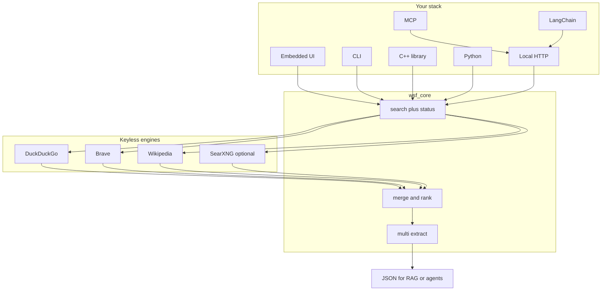
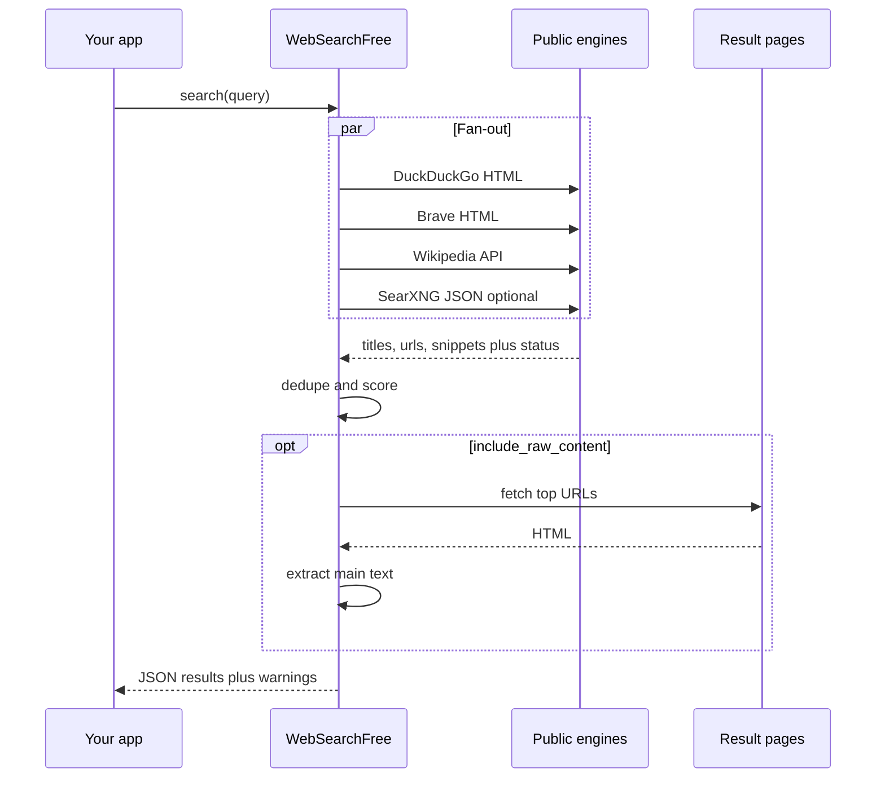
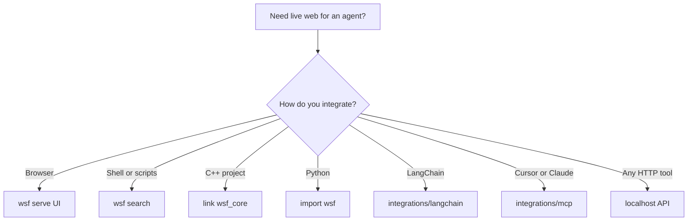

# WebSearchFree

**Free open-source Tavily alternative** — keyless web search + content extraction for AI agents, RAG, LangChain, MCP, and LLM tools.

Self-host a local **web search API for AI** with **no API key**, **no quota**, and **no per-query bill**. Drop-in style JSON similar to [Tavily](https://tavily.com), without paying for [Serper](https://serper.dev), [Exa](https://exa.ai), [Linkup](https://www.linkup.so), [Brave Search API](https://brave.com/search/api/), [SerpAPI](https://serpapi.com), or [Firecrawl](https://www.firecrawl.dev) search credits.

> Looking for a **free Tavily**, **open source web search for RAG**, or a **self-hosted AI search API**? This repo is that.

No accounts. No telemetry. Outbound HTTPS only to public search engines and pages.



## Free alternative to paid AI web search APIs

| Need | Paid options | WebSearchFree |
|------|----------------|---------------|
| Agent / RAG live web results | Tavily, Linkup, Exa, You.com | Yes, local |
| SERP-style search JSON | Serper, SerpAPI, Bing Search API | Yes, metasearch |
| Page → clean text for LLMs | Firecrawl, Tavily extract | Yes, `extract` / `--raw` |
| API key / monthly credits | Required | **None** |
| Data leaves your machine for the vendor | Usually yes | **No vendor cloud** — you run the binary |

## Features (v0.2.1)

- **Plug and play**: Docker / GHCR, one-line install scripts, GitHub Release binaries
- **Metasearch** across DuckDuckGo HTML, Brave Search HTML, Wikipedia, and optional SearXNG
- **Honest status**: per-engine `ok` / `error`, `warnings`, real `response_time`
- **Multi-URL extract** with structured per-URL status (`ok`, `robots_denied`, `fetch_failed`, `empty`)
- **Embedded UI** + **OpenAPI** + CORS on `wsf serve`
- **Drop-in clients**: HTTP Python client, MCP, LangChain, OpenAI tool schema
- **C++20 library** + **CLI** + **Python** helper
- MIT licensed

### Non-goals (honest)

- No LLM-generated `answer`, image search, or `follow_up_questions` (fields are null/empty)
- No JavaScript page rendering
- Result quality depends on upstream HTML/APIs

## Plug and play (no C++ build required)

Pick one path. Every path exposes the same local API at `http://127.0.0.1:8080`.

| Path | Command |
|------|---------|
| **Docker (any OS)** | `docker run --rm -p 8080:8080 ghcr.io/drmikecrypto/websearchfree:latest` |
| **Compose (this repo)** | `docker compose up --build` |
| **Windows one-liner** | `irm https://raw.githubusercontent.com/drmikecrypto/WebSearchFree/main/scripts/install.ps1 \| iex` |
| **Linux one-liner** | `curl -fsSL https://raw.githubusercontent.com/drmikecrypto/WebSearchFree/main/scripts/install.sh \| bash` |

Then open [http://127.0.0.1:8080](http://127.0.0.1:8080) or call the API:

```bash
curl -s -X POST http://127.0.0.1:8080/search \
  -H "Content-Type: application/json" \
  -d '{"query":"open source metasearch","max_results":5}'
```

Release binaries are self-contained (static MSVC CRT on Windows; no MinGW DLL hell). Tag `v*` to publish via GitHub Actions → Releases + GHCR.

### Drop into another project

1. Run WebSearchFree (Docker/binary above).
2. Copy one client:

| Your stack | Drop-in |
|------------|---------|
| Any language / HTTP | `POST /search`, `POST /extract` — see `/openapi.json` |
| Python (stdlib) | copy [`integrations/http/client.py`](integrations/http/client.py) |
| OpenAI tool calling | [`examples/openai_tools.json`](examples/openai_tools.json) + [`examples/drop_in_agent.py`](examples/drop_in_agent.py) |
| LangChain | [`integrations/langchain/wsf_tool.py`](integrations/langchain/wsf_tool.py) |
| Cursor / Claude MCP | [`integrations/mcp/server.py`](integrations/mcp/server.py) |

```python
# anywhere — stdlib only
import sys
sys.path.insert(0, "path/to/WebSearchFree/integrations/http")
from client import WebSearchFree

wsf = WebSearchFree()  # or WebSearchFree("http://127.0.0.1:8080")
print(wsf.search("open source metasearch", max_results=5))
print(wsf.extract(["https://example.com"]))
```

Set `WSF_BASE_URL` if the server is not on localhost:8080. Optional `.env` keys: see [`.env.example`](.env.example).

## Quick start (build from source)

### Docker (local build)

```bash
docker compose up --build
```

Open [http://127.0.0.1:8080](http://127.0.0.1:8080) for the UI. API: `POST /search`, `POST /extract`, `GET /health`, `GET /openapi.json`.

### Build (Windows / MinGW or MSVC)

```bash
cmake -S . -B build -DCMAKE_BUILD_TYPE=Release -G "MinGW Makefiles" -DCMAKE_CXX_COMPILER=C:/mingw64/bin/g++.exe
cmake --build build -j
ctest --test-dir build --output-on-failure
```

Binary: `build/wsf.exe` (or `build/wsf`). MinGW builds link `-static`; MSVC builds use static CRT — you should not need extra compiler DLLs next to the exe.

### Search (no keys)

```bash
./build/wsf search "open source metasearch" --max 5 --json
```

### Extract a URL

```bash
./build/wsf extract https://example.com --json
```

### Local HTTP — Tavily-compatible shape for agents

```bash
./build/wsf serve --host 127.0.0.1 --port 8080
```

```bash
curl -s -X POST http://127.0.0.1:8080/search \
  -H "Content-Type: application/json" \
  -d '{"query":"open source metasearch","max_results":5,"include_raw_content":false}'
```

```bash
curl -s -X POST http://127.0.0.1:8080/extract \
  -H "Content-Type: application/json" \
  -d '{"urls":["https://example.com","https://example.org"]}'
```

No `Authorization` header required.

### MCP (Cursor / Claude Desktop)

1. Start the API: `wsf serve --port 8080`
2. Add to MCP config:

```json
{
  "mcpServers": {
    "websearchfree": {
      "command": "python",
      "args": ["integrations/mcp/server.py"],
      "env": { "WSF_BASE_URL": "http://127.0.0.1:8080" }
    }
  }
}
```

Tools: `web_search`, `web_extract` (stdlib only; HTTP preferred, CLI fallback).

### LangChain

```bash
pip install langchain-core
# with wsf serve running:
```

```python
import sys
sys.path.insert(0, ".")
from integrations.langchain.wsf_tool import WebSearchFreeTool

tool = WebSearchFreeTool(base_url="http://127.0.0.1:8080")
print(tool.invoke({"query": "open source metasearch", "max_results": 5}))
```

### C++

```cpp
#include "wsf/wsf.hpp"

auto resp = wsf::search("open source metasearch");
for (const auto& r : resp.results) {
  // r.title, r.url, r.content, r.score
}
// resp.engines, resp.warnings, resp.response_time
```

### Python

```bash
cmake -S . -B build -DWSF_BUILD_PYTHON=ON ...
# or call the CLI via bindings/python/wsf/__init__.py fallback
```

```python
import sys
sys.path.insert(0, "bindings/python")
import wsf
print(wsf.search("open source metasearch", max_results=5))
print(wsf.extract_one("https://example.com"))
```

## How it works



This is **metasearch**, not a sovereign web index. For personal and small-team RAG this is usually enough; it is not a hosted SaaS SLA.

Related: [SearXNG](https://github.com/searxng/searxng). Point WebSearchFree at your instance with `WSF_SEARX_URL` or `--searx-url` and include `searx` in `--engines`.

## Engines

| Name | Source | Key |
|------|--------|-----|
| `ddg` | DuckDuckGo HTML | none |
| `brave` | Brave Search HTML | none |
| `wikipedia` | MediaWiki opensearch | none |
| `searx` | Your SearXNG (`format=json`) | none (needs URL) |

```bash
wsf search "query" --engines ddg,wikipedia
wsf search "query" --engines ddg,searx --searx-url http://127.0.0.1:8888
# or: export WSF_SEARX_URL=http://127.0.0.1:8888
```

## Adoption paths



## FAQ

**Is WebSearchFree a free Tavily alternative?**  
Yes for search + extract without keys. It does not generate AI answers or images.

**Do I need Serper, SerpAPI, Bing, or Google Programmable Search?**  
No for the built-in engines. Optional SearXNG is also keyless if you self-host it.

**Is it the same as SearXNG?**  
Same family (metasearch), different packaging: WebSearchFree is an embeddable agent-oriented binary with Tavily-shaped JSON. You can also use SearXNG as a backend engine.

**Does it phone home or require signup?**  
No.

## Project layout

```
include/wsf/              Public C++ API
src/                      Core: HTTP, engines, extract, rank
apps/wsf_cli/             CLI + HTTP server + embedded UI
bindings/python/          pybind11 module + CLI wrapper
integrations/http/        Stdlib Python HTTP client (drop-in)
integrations/mcp/         Stdio MCP server
integrations/langchain/   LangChain tools
scripts/install.*         One-line binary installers
examples/                 curl, OpenAI tools, drop-in agent
Dockerfile / compose      Production image + healthcheck
.github/workflows/        CI + Release (binaries + GHCR)
```

## Keywords

`free tavily alternative` · `open source web search api for ai` · `self hosted rag search` · `keyless serp for llm` · `langchain web search free` · `mcp web search` · `tavily open source` · `serper alternative free` · `exa alternative self host` · `ai agent web search no api key`

## License

MIT — see [LICENSE](LICENSE).

Maintained by [drmikecrypto](https://github.com/drmikecrypto).
