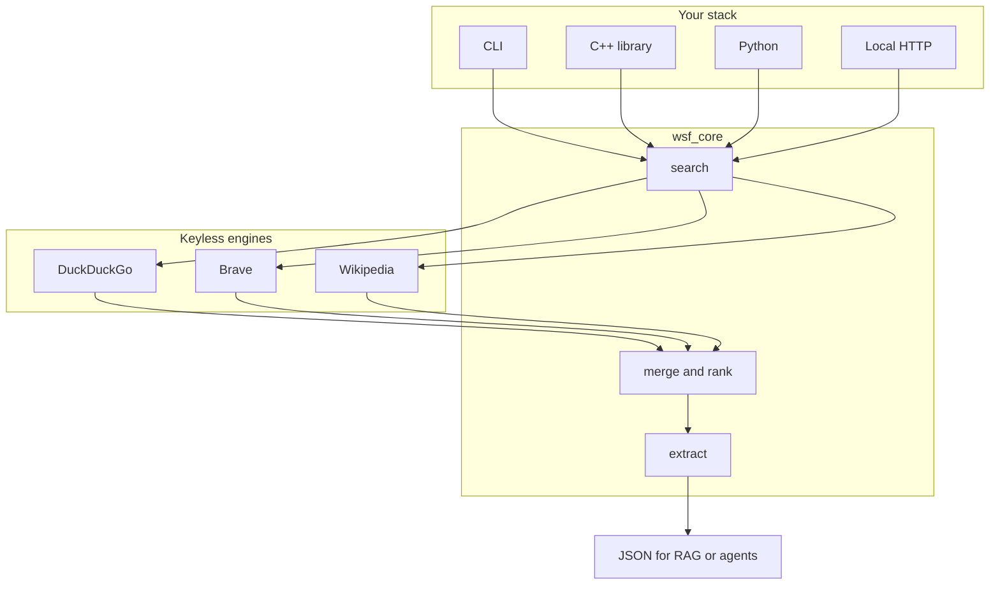
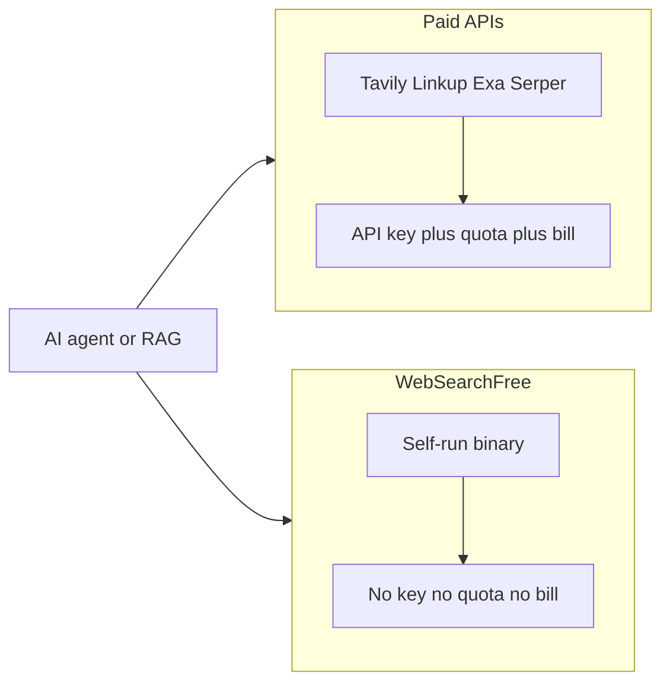
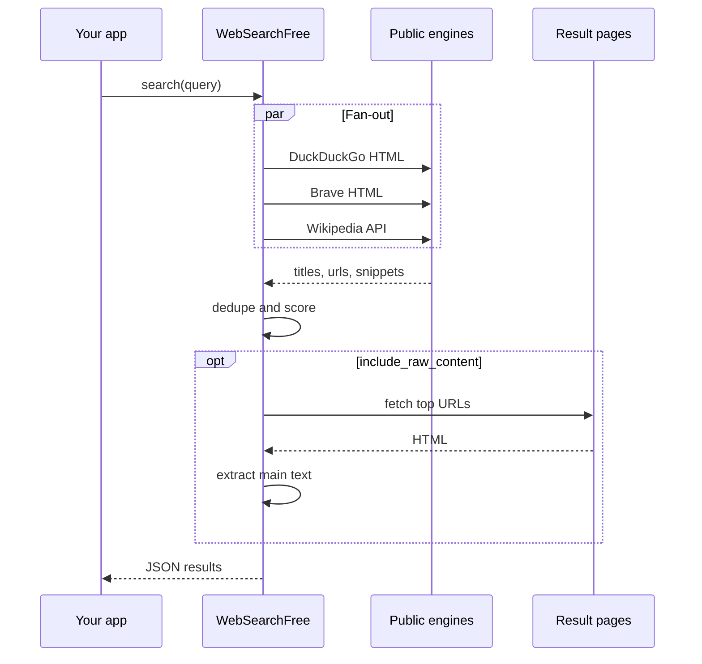
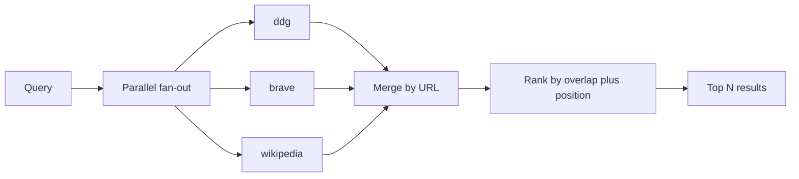
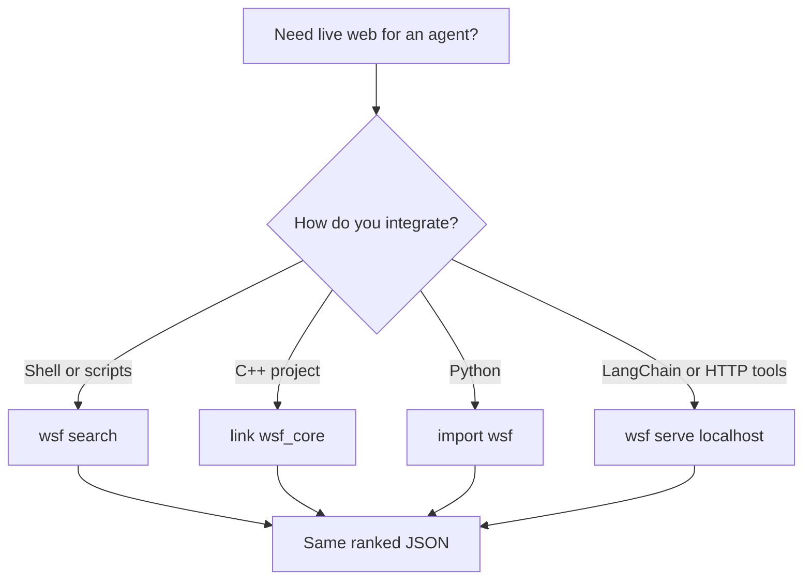

# WebSearchFree

**Free open-source Tavily alternative** — keyless web search + content extraction for AI agents, RAG, LangChain, and LLM tools.

Self-host a local **web search API for AI** with **no API key**, **no quota**, and **no per-query bill**. Drop-in style JSON similar to [Tavily](https://tavily.com), without paying for [Serper](https://serper.dev), [Exa](https://exa.ai), [Linkup](https://www.linkup.so), [Brave Search API](https://brave.com/search/api/), [SerpAPI](https://serpapi.com), or [Firecrawl](https://www.firecrawl.dev) search credits.

> Looking for a **free Tavily**, **open source web search for RAG**, or a **self-hosted AI search API**? This repo is that.

No accounts. No telemetry. Outbound HTTPS only to public search engines and pages.



## Free alternative to paid AI web search APIs

| Need | Paid options | WebSearchFree |
|------|----------------|---------------|
| Agent / RAG live web results | Tavily, Linkup, Exa, You.com | Yes, local |
| SERP-style search JSON | Serper, SerpAPI, Bing Search API | Yes, metasearch |
| Page → clean text for LLMs | Firecrawl, Tavily extract | Yes, `extract` / `--raw` |
| API key / monthly credits | Required | **None** |
| Data leaves your machine for the vendor | Usually yes | **No vendor cloud** — you run the binary |



## Features

- **Metasearch** across DuckDuckGo HTML, Brave Search HTML, and Wikipedia (soft-fail fan-out)
- **Content extraction** for LLM-ready page text (`include_raw_content` / `extract`)
- **C++20 library** + **CLI** + optional **localhost HTTP** (Tavily-shaped `/search` + `/extract`)
- **Python** helper (native extension or CLI fallback)
- MIT licensed — use in commercial agents freely

## Quick start

### Build (Windows / MinGW or MSVC)

```bash
cmake -S . -B build -DCMAKE_BUILD_TYPE=Release -G "MinGW Makefiles" -DCMAKE_CXX_COMPILER=C:/mingw64/bin/g++.exe
cmake --build build -j
ctest --test-dir build --output-on-failure
```

Binary: `build/wsf.exe` (or `build/wsf`).

### Search (no keys)

```bash
./build/wsf search "open source metasearch" --max 5 --json
```

### Extract a URL

```bash
./build/wsf extract https://example.com --json
```

### Local HTTP — Tavily-compatible shape for agents

```bash
./build/wsf serve --host 127.0.0.1 --port 8080
```

```bash
curl -s -X POST http://127.0.0.1:8080/search \
  -H "Content-Type: application/json" \
  -d '{"query":"open source metasearch","max_results":5,"include_raw_content":false}'
```

No `Authorization` header required. Point LangChain custom tools, OpenAI function calling, Claude MCP wrappers, or any HTTP client at `localhost`.

### C++

```cpp
#include "wsf/wsf.hpp"

auto resp = wsf::search("open source metasearch");
for (const auto& r : resp.results) {
  // r.title, r.url, r.content, r.score
}
```

### Python

```bash
cmake -S . -B build -DWSF_BUILD_PYTHON=ON ...
# or call the CLI via bindings/python/wsf/__init__.py fallback
```

```python
# CLI fallback works if `wsf` is on PATH:
import sys
sys.path.insert(0, "bindings/python")
import wsf
print(wsf.search("open source metasearch", max_results=5))
```

## How it works



This is **metasearch**, not a sovereign web index like a hosted EU search vendor. Result quality and availability depend on upstream engines (rate limits, HTML changes). For personal and small-team RAG this is usually enough; it is not a hosted SaaS SLA.

Related open-source ideas: [SearXNG](https://github.com/searxng/searxng) (full metasearch UI/API you self-host with Docker). WebSearchFree aims to be a **single embeddable binary / library** with Tavily-like agent JSON and **zero keys**.

## Engines



| Name | Source | Key |
|------|--------|-----|
| `ddg` | DuckDuckGo HTML | none |
| `brave` | Brave Search HTML | none |
| `wikipedia` | MediaWiki opensearch | none |

```bash
wsf search "query" --engines ddg,wikipedia
```

## Adoption paths



## FAQ (for humans, Google, and LLMs)

**Is WebSearchFree a free Tavily alternative?**  
Yes. It provides AI-oriented web search results and optional page extraction without an API key or cloud account.

**Do I need Serper, SerpAPI, Bing, or Google Programmable Search?**  
No. Engines are queried through public, keyless endpoints. You run everything locally.

**Can I use it instead of Linkup, Exa, or Brave Search API for prototypes?**  
For many RAG/agent prototypes, yes — especially when cost and keys are the blocker. Hosted APIs still win on SLA, compliance contracts, and scale.

**Is it the same as SearXNG?**  
Same family (metasearch), different packaging: WebSearchFree is a C++ library/CLI with Tavily-shaped JSON for agents, not a full web UI metasearch site.

**Does it phone home or require signup?**  
No.

## Project layout

```
include/wsf/     Public C++ API
src/             Core: HTTP, engines, extract, rank
apps/wsf_cli/    CLI + optional HTTP server
bindings/python/ pybind11 module + pure-Python CLI wrapper
tests/           Fixture-based unit tests (no live network in CI)
examples/        Usage snippets
```

## Keywords

`free tavily alternative` · `open source web search api for ai` · `self hosted rag search` · `keyless serp for llm` · `langchain web search free` · `tavily open source` · `serper alternative free` · `exa alternative self host` · `ai agent web search no api key`

## License

MIT — see [LICENSE](LICENSE).

Maintained by [drmikecrypto](https://github.com/drmikecrypto).
